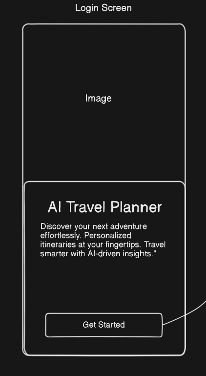
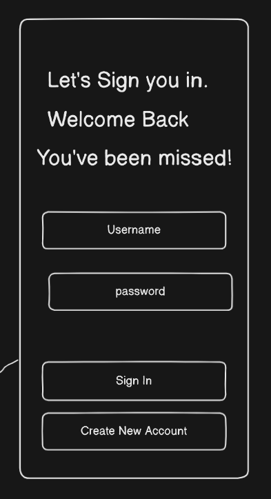
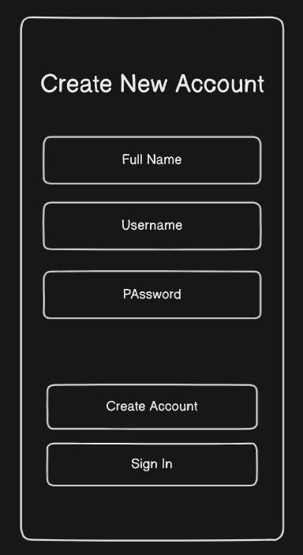
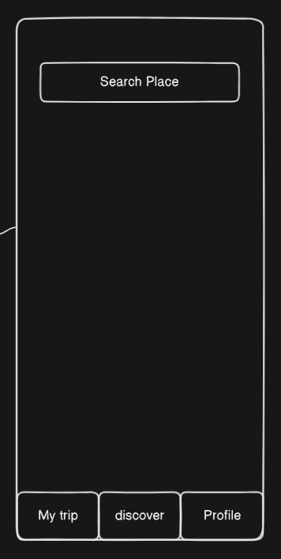
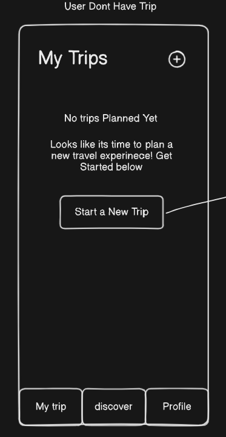
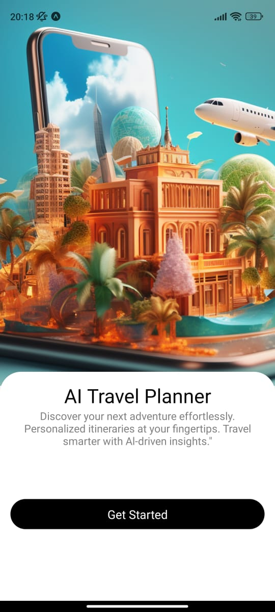
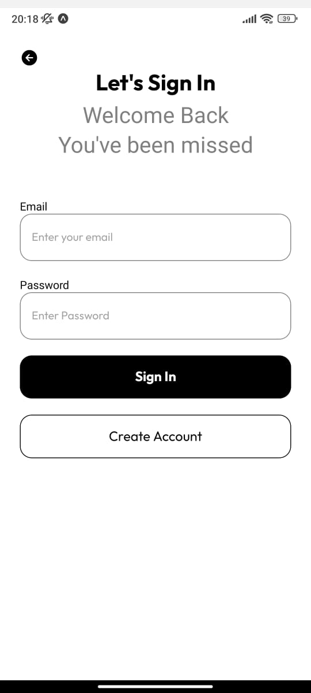
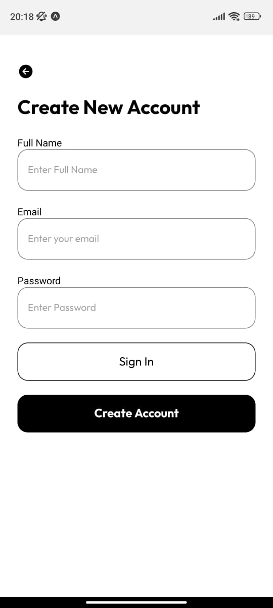

# AI-Travel Planner


AI-Travel Planner is a mobile application designed to help users plan their trips using AI-powered recommendations. Built with React Native, Expo, and Firebase Authentication, the app provides a seamless experience for users to create, manage, and share their travel itineraries.

## Installation

Follow these steps to set up the project locally:

1. **Clone the Repository**:
   ```bash
   git clone https://github.com/WimukthiMadushan/AI-Travel-Planner-App.git

## Screenshots

## Here are some screenshots of the GUI:

<div style="display: flex; justify-content: space-between; align-items: center;">

  <div style="margin-right: 10px; text-align: center;">
    <h4>First Page</h4>
    
  </div>

  <div style="margin-right: 10px; text-align: center;">
    <h4>Login Page</h4>
    
  </div>

  <div style="margin-right: 10px; text-align: center;">
    <h4>Create Account</h4>
    
  </div>

  <div style="margin-right: 10px; text-align: center;">
    <h4>Search Trip</h4>
    
  </div>

  <div style="text-align: center;">
    <h4>My Trips</h4>
    
  </div>

</div>


## Screenshots of Already Finished Pages

<div style="display: flex; justify-content: space-between;">

  ### First Page
  

  ### Login Page
  

  ### Create Account
  

</div>

   
